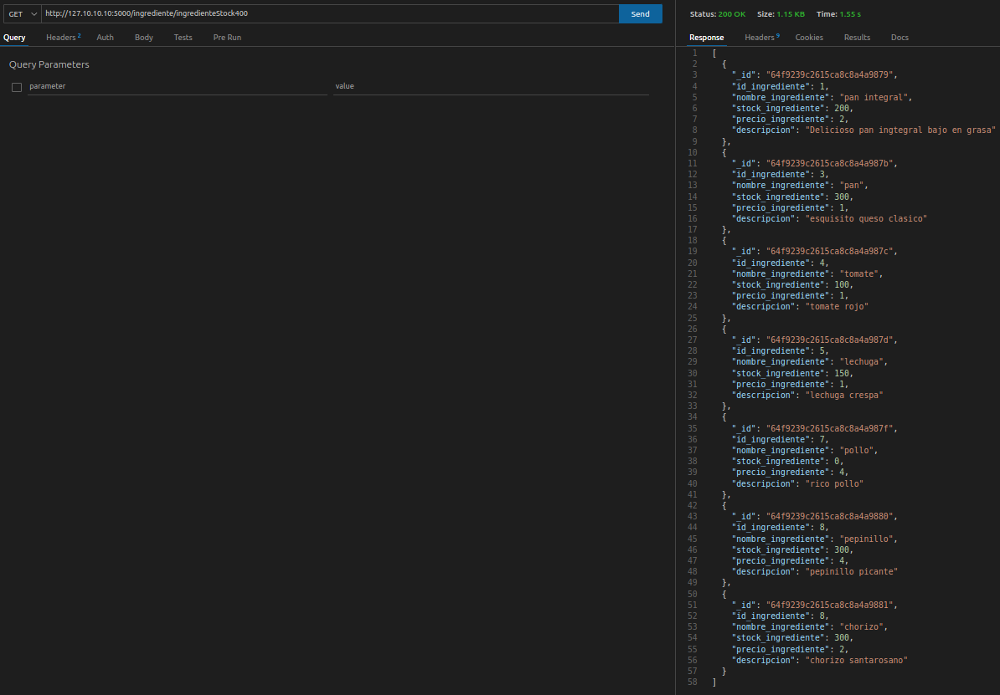
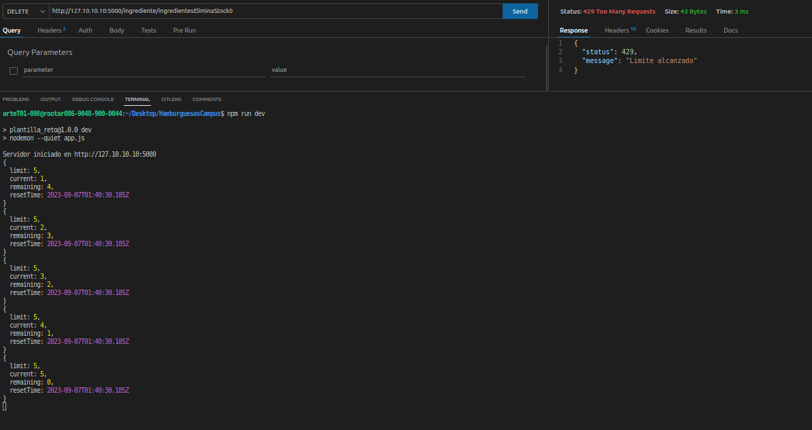

# SOBRE LA APP:

Esta es una applicación para la gestión de una cafeteria especializada en hamburguesas, podrás realizar multiples consultas para diferente tipo de informacion, la App está basada en una base de datos Mongo y se utilizo noje.js v18.16.1, además de eso utilizamos algunas librerías las cuales las podrás ver en el archivo package.json.

# **Pasos para Configurar y Usar la Aplicación:**

***1. Clonar el Repositorio:*** Clona este repositorio en tu máquina local usando el link:

```
 https://github.com/DiegoMartinez2094/HamburguesasCampus.git
```

***2. Instalar Dependencias:*** Asegúrate de tener Node.js instalado. Luego, desde la raíz del proyecto, ejecuta el siguiente comando para instalar las dependencias:

```
npm install
```

***3. Configurar Variables de Entorno:*** Abre el archivo `.env.example` y verifica las variables de entorno necesarias para la conexión al servidor y a la base de datos en Atlas. Asegúrate de proporcionar los valores correctos para `My_server`, `ATLAS_USER`, `ATLAS_PASSWORD` y `ATLAS_DB`. y quita .example que el nombre del archivo sea solo `.env`

***4. Conectar la Base de Datos:*** Para conectar la base de datos utilizando la extensión "MongoDB for VS Code":

* Abre la extensión y selecciona "Connect". Se te pedirá el enlace de conexión de la base de datos que encontrarás en tu página de Atlas.
* Ingresa el enlace de la forma:
  ```
  mongodb+srv://<nombreusuario>:<password>@cluster0.<subdominio>.mongodb.net/
  ```
* Reemplaza `nombreusuaio, password y subdominio`
* Una vez conectado, ejecuta el archivo `db/base_datos.mongodb` haciendo clic en el botón "Mongo Run" en la esquina superior derecha.

***5.Iniciar archivo:*** Ejecutamos el archivo `app.js` mediante el siguiente comando en la terminal:

```
npm run dev
```

Nos dará un mensaje similar a este: `Servidor iniciado en http://127.10.10.10:5011` que nos indica la direccion url donde está corriendo el servidor.

# BASE DE DATOS:

En el apartado del Schema de la base de datos, todos los campos son requeridos.

```
use("filtroHamburguesa_DiegoMartinez")

db.hamburguesa.insertMany([{
    id_hamburguesa:1,
    categoria: "vegetariana",
    preparadaPor: "chefA",
    ingrediente:["pan integral", "tomate", "queso cheddar", "lechuga"],
    precio_hamburguesa: 4
},
{
    id_hamburguesa:2,
    categoria: "clasica",
    preparadaPor: "chefB",
    ingrediente:["pan", "queso cheddar", "carne", "lechuga"],
    precio_hamburguesa: 5
},
{
    id_hamburguesa:3,
    categoria: "gourmet",
    preparadaPor: "chefC",
    ingrediente:["pan", "queso cheddar","tomate", "lechuga", "pollo", "pepinillo","coriozo sanatarosano" ],
    precio_hamburguesa: 10
},
{
  id_hamburguesa:4,
  categoria: "especial",
  preparadaPor: "chefB",
  ingrediente:["pan", "queso cheddar","tomate", "pollo", "pepinillo","coriozo sanatarosano" ],
  precio_hamburguesa: 9
}
])

db.ingrediente.insertMany([{
    id_ingrediente:1,
    nombre_ingrediente:"pan integral",
    stock_ingrediente: 200,
    precio_ingrediente: 2,
    descripcion:"Delicioso pan ingtegral bajo en grasa"
},
{
    id_ingrediente:2,
    nombre_ingrediente:"queso cheddar",
    stock_ingrediente: 500,
    precio_ingrediente: 3,
    descripcion:"esquisito queso clasico"
},
{
    id_ingrediente:3,
    nombre_ingrediente:"pan",
    stock_ingrediente: 300,
    precio_ingrediente: 1,
    descripcion:"esquisito queso clasico"
},
{
    id_ingrediente:4,
    nombre_ingrediente:"tomate",
    stock_ingrediente: 100,
    precio_ingrediente: 1,
    descripcion:"tomate rojo"
},
{
    id_ingrediente:5,
    nombre_ingrediente:"lechuga",
    stock_ingrediente: 150,
    precio_ingrediente: 1,
    descripcion:"lechuga crespa"
},
{
    id_ingrediente:6,
    nombre_ingrediente:"carne",
    stock_ingrediente: 1000,
    precio_ingrediente: 4,
    descripcion:"jugosa carne de res"
},
{
    id_ingrediente:7,
    nombre_ingrediente:"pollo",
    stock_ingrediente: 0,
    precio_ingrediente: 4,
    descripcion:"rico pollo"
},{
    id_ingrediente:8,
    nombre_ingrediente:"pepinillo",
    stock_ingrediente: 300,
    precio_ingrediente: 4,
    descripcion:"pepinillo picante"
},
{
  id_ingrediente:8,
  nombre_ingrediente:"chorizo",
  stock_ingrediente: 300,
  precio_ingrediente: 2,
  descripcion:"chorizo santarosano"
}
])

db.chef.insertMany([{
    id_chef:1,
    nombre_chef: "chefB",
     especialidad_chef:"carnes"
},
{
    id_chef:2,
    nombre_chef: "chefA",
     especialidad_chef:"vegetales"
},
{
    id_chef:1,
    nombre_chef: "chefC",
     especialidad_chef:"pollo"
},
{
    id_chef:1,
    nombre_chef: "chefD",
     especialidad_chef:"carnes"
}])
```

# USO DE LA APP

para realizar las debidas consultas utilizaremos una extension muy util de VS Code llamada: thunderClient, en la cuál implementaremos los siguientes routers:

debemos insertar el router y el meodo que necesitamos ejemplo:



Routers:

**Encontrar todos los ingredientes con stock menor a 400 : GET
http://127.10.10.10:5000/ingrediente/ingredienteStock400
esta es la respuesta del router:**

```
[
  {
    "_id": "64f9239c2615ca8c8a4a9879",
    "id_ingrediente": 1,
    "nombre_ingrediente": "pan integral",
    "stock_ingrediente": 200,
    "precio_ingrediente": 2,
    "descripcion": "Delicioso pan ingtegral bajo en grasa"
  },
  {
    "_id": "64f9239c2615ca8c8a4a987b",
    "id_ingrediente": 3,
    "nombre_ingrediente": "pan",
    "stock_ingrediente": 300,
    "precio_ingrediente": 1,
    "descripcion": "esquisito queso clasico"
  },
  {
    "_id": "64f9239c2615ca8c8a4a987c",
    "id_ingrediente": 4,
    "nombre_ingrediente": "tomate",
    "stock_ingrediente": 100,
    "precio_ingrediente": 1,
    "descripcion": "tomate rojo"
  },
  {
    "_id": "64f9239c2615ca8c8a4a987d",
    "id_ingrediente": 5,
    "nombre_ingrediente": "lechuga",
    "stock_ingrediente": 150,
    "precio_ingrediente": 1,
    "descripcion": "lechuga crespa"
  },
  {
    "_id": "64f9239c2615ca8c8a4a987f",
    "id_ingrediente": 7,
    "nombre_ingrediente": "pollo",
    "stock_ingrediente": 0,
    "precio_ingrediente": 4,
    "descripcion": "rico pollo"
  },
  {
    "_id": "64f9239c2615ca8c8a4a9880",
    "id_ingrediente": 8,
    "nombre_ingrediente": "pepinillo",
    "stock_ingrediente": 300,
    "precio_ingrediente": 4,
    "descripcion": "pepinillo picante"
  },
  {
    "_id": "64f9239c2615ca8c8a4a9881",
    "id_ingrediente": 8,
    "nombre_ingrediente": "chorizo",
    "stock_ingrediente": 300,
    "precio_ingrediente": 2,
    "descripcion": "chorizo santarosano"
  }
]
```

**Encontrar todas las hamburguesas de la categoría "*Vegetariana*": GET
 http://127.10.10.10:5000/hamburguesa/hamburguesaVegetariana
esta es la respuesta del router:**

```
[
  {
    "_id": "64f9239c2615ca8c8a4a9875",
    "id_hamburguesa": 1,
    "categoria": "vegetariana",
    "preparadaPor": "chefA",
    "ingrediente": [
      "pan integral",
      "tomate",
      "queso cheddar",
      "lechuga"
    ],
    "precio_hamburguesa": 4
  }
]
```

**Encontrar todos los chefs que se especializan en "Carnes"**: GET
**http://127.10.10.10:5000/chef/chefCarne
esta es la respuesta del router:**

```
[
  {
    "_id": "64f9239c2615ca8c8a4a9882",
    "id_chef": 1,
    "nombre_chef": "chefB",
    "especialidad_chef": "carnes"
  },
  {
    "_id": "64f9239c2615ca8c8a4a9885",
    "id_chef": 1,
    "nombre_chef": "chefD",
    "especialidad_chef": "carnes"
  }
]
```

**Encontrar todas las hamburguesas preparadas por "*ChefB*"_: GET
http://127.10.10.10:5000/hamburguesa/hamburguesaXchefB
esta es la respuesta del router:**

```
[
  {
    "_id": "64f9239c2615ca8c8a4a9876",
    "id_hamburguesa": 2,
    "categoria": "clasica",
    "preparadaPor": "chefB",
    "ingrediente": [
      "pan",
      "queso cheddar",
      "carne",
      "lechuga"
    ],
    "precio_hamburguesa": 5
  },
  {
    "_id": "64f9239c2615ca8c8a4a9878",
    "id_hamburguesa": 4,
    "categoria": "especial",
    "preparadaPor": "chefB",
    "ingrediente": [
      "pan",
      "queso cheddar",
      "tomate",
      "pollo",
      "pepinillo",
      "coriozo sanatarosano"
    ],
    "precio_hamburguesa": 9
  }
]
```

**Encontrar todas las hamburguesas que contienen "*Pan integral*" como ingrediente: GET
http://127.10.10.10:5000/hamburguesa/hamburguesaPanIntegral
esta es la respuesta del router:**

```
[
  {
    "_id": "64f9239c2615ca8c8a4a9875",
    "id_hamburguesa": 1,
    "categoria": "vegetariana",
    "preparadaPor": "chefA",
    "ingrediente": [
      "pan integral",
      "tomate",
      "queso cheddar",
      "lechuga"
    ],
    "precio_hamburguesa": 4
  }
]
```

**Encontrar todas las hamburguesas que contienen exactamente 7 ingredientes: GET
http://127.10.10.10:5000/hamburguesa/hamburguesa7ingredientes
esta es la respuesta del router:**

```
[
  {
    "_id": "64f9239c2615ca8c8a4a9877",
    "id_hamburguesa": 3,
    "categoria": "gourmet",
    "preparadaPor": "chefC",
    "ingrediente": [
      "pan",
      "queso cheddar",
      "tomate",
      "lechuga",
      "pollo",
      "pepinillo",
      "coriozo sanatarosano"
    ],
    "precio_hamburguesa": 10
  }
]
```


**Listar las hamburguesas cuyo precio es menor o igual a $9: GET
http://127.10.10.10:5000/hamburguesa/hamburguesaPrecioMenorIgual9
esta es la respuesta del router:**

```
[
  {
    "_id": "64f9239c2615ca8c8a4a9875",
    "id_hamburguesa": 1,
    "categoria": "vegetariana",
    "preparadaPor": "chefA",
    "ingrediente": [
      "pan integral",
      "tomate",
      "queso cheddar",
      "lechuga"
    ],
    "precio_hamburguesa": 4
  },
  {
    "_id": "64f9239c2615ca8c8a4a9876",
    "id_hamburguesa": 2,
    "categoria": "clasica",
    "preparadaPor": "chefB",
    "ingrediente": [
      "pan",
      "queso cheddar",
      "carne",
      "lechuga"
    ],
    "precio_hamburguesa": 5
  },
  {
    "_id": "64f9239c2615ca8c8a4a9878",
    "id_hamburguesa": 4,
    "categoria": "especial",
    "preparadaPor": "chefB",
    "ingrediente": [
      "pan",
      "queso cheddar",
      "tomate",
      "pollo",
      "pepinillo",
      "coriozo sanatarosano"
    ],
    "precio_hamburguesa": 9
  }
]
```

**Encontrar todas las hamburguesas que contienen "Tomate" o "Lechuga" como ingredientes: GET
http://127.10.10.10:5000/hamburguesa/hamburguesaTomateOLechuga
esta es la respuesta del router:**

```
[
  {
    "_id": "64f9239c2615ca8c8a4a9875",
    "id_hamburguesa": 1,
    "categoria": "vegetariana",
    "preparadaPor": "chefA",
    "ingrediente": [
      "pan integral",
      "tomate",
      "queso cheddar",
      "lechuga"
    ],
    "precio_hamburguesa": 4
  },
  {
    "_id": "64f9239c2615ca8c8a4a9876",
    "id_hamburguesa": 2,
    "categoria": "clasica",
    "preparadaPor": "chefB",
    "ingrediente": [
      "pan",
      "queso cheddar",
      "carne",
      "lechuga"
    ],
    "precio_hamburguesa": 5
  },
  {
    "_id": "64f9239c2615ca8c8a4a9877",
    "id_hamburguesa": 3,
    "categoria": "gourmet",
    "preparadaPor": "chefC",
    "ingrediente": [
      "pan",
      "queso cheddar",
      "tomate",
      "lechuga",
      "pollo",
      "pepinillo",
      "coriozo sanatarosano"
    ],
    "precio_hamburguesa": 10
  },
  {
    "_id": "64f9239c2615ca8c8a4a9878",
    "id_hamburguesa": 4,
    "categoria": "especial",
    "preparadaPor": "chefB",
    "ingrediente": [
      "pan",
      "queso cheddar",
      "tomate",
      "pollo",
      "pepinillo",
      "coriozo sanatarosano"
    ],
    "precio_hamburguesa": 9
  }
]
```

**Eliminar todos los chefs que tienen una especialidad en "Cocina Vegetariana" DELETE
http://127.10.10.10:5000/chef/chefEliminarCocinaVegetariana
esta es la respuesta del router: En este caso no había ninguno con esa especialidad**

```
{
  "acknowledged": true,
  "deletedCount": 0
}
```

**Eliminar todos los ingredientes que tengan un stock de 0: DELETE
http://127.10.10.10:5000/ingrediente/ingredientesEliminaStock0
esta es la respuesta del router: En este caso solo había 1**

```
{
  "acknowledged": true,
  "deletedCount": 1
}
```

NOTA: las demas consultas estan en el archivo : db/query_db.mongodb

---

# INFORMACIÓN ADICIONAL:

El programa cuenta con una limitador de solicitudes en un determinado tiempo que se podrá visualizar en la terminal: (solo se pueden realizar 5 consultas en 30 segundos)

